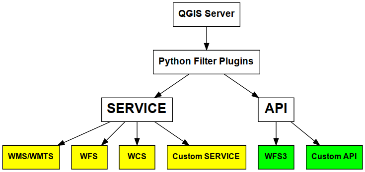

# QGIS Server 2020 Updates

## Alessandro Pasotti


-----

QGIS Updates
=====================

+ Packaging Modules
+ `QGIS_SERVER_IGNORE_BAD_LAYERS`
+ Standalone Development Server
+ OAPIF/WFS3
+ Landing Page


-----

QGIS Server Modules
=====================



----

Module Packaging
================

+ *qgis-server*
    + *qgis-server-common*
    + Services
        + *qgis-server-wms*
        + *qgis-server-wmts*
        + *qgis-server-wfs*
        + *qgis-server-wcs*
    + APIs
        + *qgis-server-wfs3*
        + *qgis-server-landingpage*


----

### QGIS_SERVER_IGNORE_BAD_LAYERS

Set `QGIS_SERVER_IGNORE_BAD_LAYERS=1` to ignore bad layers without invalidating a whole project.

----

The Development Server
======================

*:exclamation:Not suitable for production:exclamation:*


    Usage: qgis_mapserver [options] [address:port]
    QGIS Development Server

    Options:
    -l <logLevel>     Sets log level (default: 0)
                        0: INFO
                        1: WARNING
                        2: CRITICAL
    -p <projectPath>  Path to a QGIS project file (*.qgs or *.qgz),
                        if specified it will override the query string MAP argument
                        and the QGIS_PROJECT_FILE environment variable

    Arguments:
    addressAndPort    Listen to address and port (default: "localhost:8000")
                        address and port can also be specified with the environment
                        variables QGIS_SERVER_ADDRESS and QGIS_SERVER_PORT

----

WFS3/OAPIF and the new OGC APIs
===============================

Resources overrides (HTML templates, JS/CSS etc.):

Base directory for all WFS3 static resources (HTML templates, CSS, JS etc.) `QGIS_SERVER_API_RESOURCES_DIRECTORY`

https://docs.qgis.org/testing/en/docs/user_manual/working_with_ogc/server/services.html#the-html-template-language


----

# Legacy Architecture

### SERVICE modules

+ WMS WFS WCS WMTS
+ XML-based (JSON and other formats are available)

### :wrench: Customization

+ Custom modules (C++ and Python)
+ Python filter plugins (I/O, access control, cache)


----

# New OGC API Architecture


## `OGC API` modules

+ WFS3/OAPIF API handler
+ JSON / **REST** based
+ Content negotiation and HTML templates

### :wrench: Customization

+ Custom API handlers (C++ and Python)
+ Python filter plugins (I/O, access control, cache)


----


# OGC API Custom Services

New server *plugin-based* **API** architecture!

You can now create custom APIs in pure *Python*.

```python
# MyApi is a QgsServerOgcApi subclass
serverInterface.serviceRegistry().registerApi(MyApi())
```

Example: https://github.com/elpaso/qgis3-server-vagrant/blob/master/resources/web/plugins/customapi/customapi.py


---

# Landing Page Module


----

# Coming Soon (hopefully)

:star: **WMS-T** Raster Catalog with Temporal Controller Integration
:star: OGC API for Tiles
:star: Landing Page WebGIS Forms
:star: Landing Page WebGIS Editing
:star: Server Monitoring API
:star: Server Instances Shared Cache